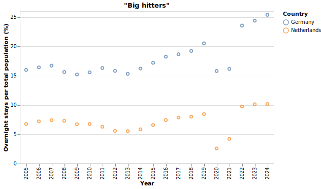
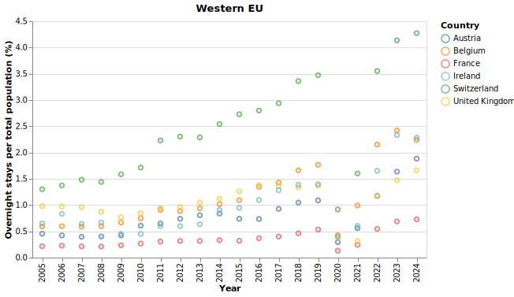
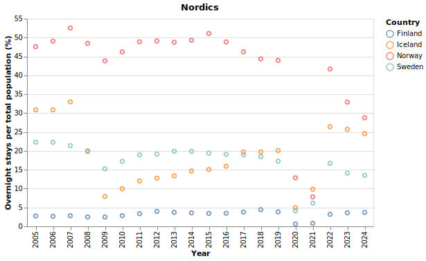
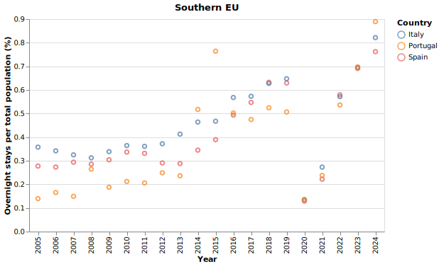
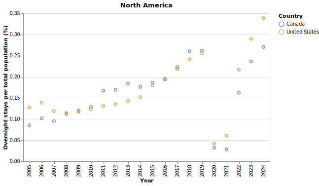

# Tourist data mini-project (2026)

- [Executive summary](#executive-summary)
  - [Current progress](#current-progress)
  - [Charts](#charts)
    - ["Big hitters"](#big-hitters)
    - [Western EU](#western-eu)
    - [Nordics (excluding Denmark)](#nordics-excluding-denmark)
    - [Southern EU](#southern-eu)
    - [North America](#north-america)
  - [Preliminary findings](#preliminary-findings)
  - [Research questions](#research-questions)
  - [Potential statistical approach](#potential-statistical-approach)
- [Technical decisions](#technical-decisions)
  - [Choice of dataframe library](#choice-of-dataframe-library)
  - [Development process](#development-process)
  - [Statistics packages to consider](#statistics-packages-to-consider)
- [Scope and granularity of data](#scope-and-granularity-of-data)
- [Data sources](#data-sources)

## Executive summary

TODO: Answer the question for why I'm focusing so much on the tech explanations and less on other things.

**Read the full report [here](), with an executive summary in Danish and commentary and analysis in Danish and English.**

This project is an introductory exploration of a [tourist database](https://www.statistikbanken.dk/TURIST) that tracks overnight stays in Denmark by nationality, time period, country region, and other categories. The goal of this project is to gain a sufficient overview of this area, find insights, propose and test hypotheses, visualize and analyze results, and draw useful conclusions.

### Current progress

- [x] Selection of relevant data
- [x] Data extraction
- [x] Processing of initial data
- [x] Data normalization
- [x] Initial visualization
- [x] Initial commentary
- [x] Formulation of research questions
- [ ] Selection of statistical tools and methods
- [ ] Statistical analysis
- [ ] Final chart generation
- [ ] (Optional) Power BI dashboard
- [ ] Analysis write-up
- [ ] Conclusion write-up

<b>Click on the arrow below to expand and see the current charts</b>

### Charts

#### "Big hitters"

#### Western EU

#### Nordics (excluding Denmark)

#### Southern EU

#### North America

### Preliminary findings

- 2005
- Regional trends
- UK not affected?
- Iceland
- Potential promise for climate change hypothesis?

### Research questions

- How do tourist visits correlate with the working and retired populations of each country?
- How do they correlate with climate - using a proxy measure of 30+ degree days?
- Are there any interesting tourist trends within the Nordic countries?
- Has Brexit affected tourism from the UK long-term?
- How impactful was COVID on tourism?
- Dependency ratio
- Hot days
- Regional trends

### Potential statistical approach

Curve fitting, regressions, hypothesis testing

## Technical decisions

### Choice of dataframe library

I was originally going to do this project with the classic [pandas](https://pandas.pydata.org/) + [matplotlib](https://matplotlib.org/) combo, but there have been some interesting developments over the last several years in the dataframe and data visualization space. The pandas API can be cumbersome and unintuitive, and libraries that accomplish similar goals have exploded in popularity recently, and for good reason.

Among them is [Polars](https://docs.pola.rs/). It seems to be popular, standarized, and mature and feature complete enough to be a full replacement, and I found it extremely easy to start working with. So, I decided to instead learn enough of Polars to make this mini-project. The docs are excellent after all. And while the performance benefits are irrelevant for this project, this seems to be an all-round improvement on pandas by every possible measure, but especially the API.

Polars also has native support for [Altair](https://altair-viz.github.io/index.html), so I used that library to render charts and plots.

### Development process

- Prototype everything in iPython, one step at a time.
- Once I have enough to acheive a particular goal, refactor and add the code to a script. Repeat for the next goal.
- At the end, create a Jupyter notebook with the most important code and results, interspersed with text blocks that explain my thought process. Render that to a PDF as the final main artifact.

### Statistics packages to consider

I haven't yet needed to use these libraries so far, but for statistical analysis, I am considering one or more of the following:

- [scipy](https://docs.scipy.org/doc/scipy/tutorial/index.html#user-guide)
  - [stats module](https://docs.scipy.org/doc/scipy/tutorial/stats.html)
  - [curve_fit](https://docs.scipy.org/doc/scipy/reference/generated/scipy.optimize.curve_fit.html)
- [numpy](https://numpy.org/doc/stable/index.html)
  - [statistics](https://numpy.org/doc/stable/reference/routines.statistics.html)
- [scikit-learn](https://scikit-learn.org/stable/)
  - [regressions](https://scikit-learn.org/stable/supervised_learning.html)

## Scope and granularity of data

As this is meant to be a small project, the data for all sources is very coarse-grained. For example, while it is possible to extract much more detailed tourist data, from monthly figures, to which types of places people stayed the night, I wanted to limit how much data I based my analysis on. All data tables are therefore based on annualized figures and relatively few columns.

The tourist data is complete through 2025, the population data through 2024, and the climate data through 2023. All extracted data goes as far back as 1992, as that is the earliest available year for the tourist dataset.

## Data sources

See the images folder for screenshots of how the data was selected from each source.

- [Tourist visits](https://www.statistikbanken.dk/TURIST)
- [Climate data](https://climateknowledgeportal.worldbank.org/download-data)
  - [Sample API call for Denmark](https://cckpapi.worldbank.org/api/v1/era5-x0.25_timeseries_hd30_timeseries_annual_1950-2023_mean_historical_era5_x0.25_mean/DNK?_format=json)
- [Country populations (link goes to exact configuration)](https://data-explorer.oecd.org/vis?lc=en&df[ds]=DisseminateFinalDMZ&df[id]=DSD_POPULATION%40DF_POP_HIST&df[ag]=OECD.ELS.SAE&df[vs]=1.0&dq=FIN%2BISL%2BITA%2BNOR%2BPRT%2BSWE%2BAUT%2BFRA%2BDEU%2BIRL%2BNLD%2BESP%2BCHE%2BGBR%2BUSA%2BCAN%2BBEL..PS._T._T%2BY15T64%2BY_GE65.&pd=1992%2C2024&to[TIME_PERIOD]=false&vw=tb)
